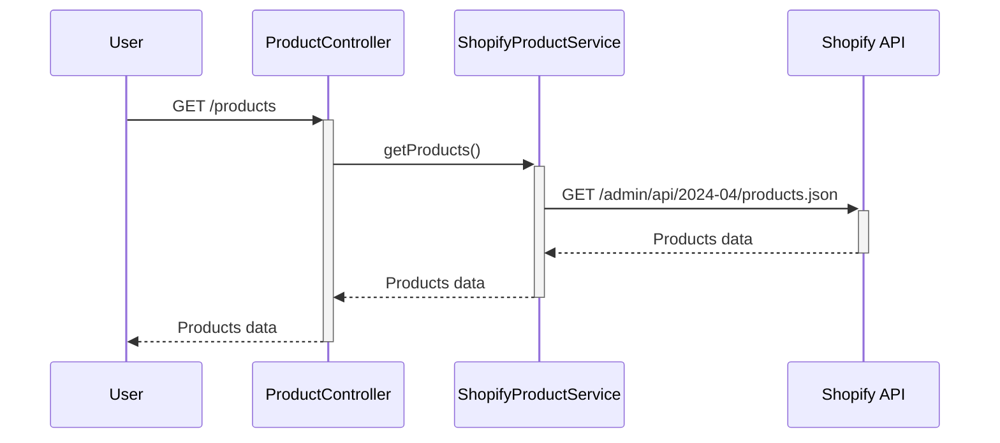
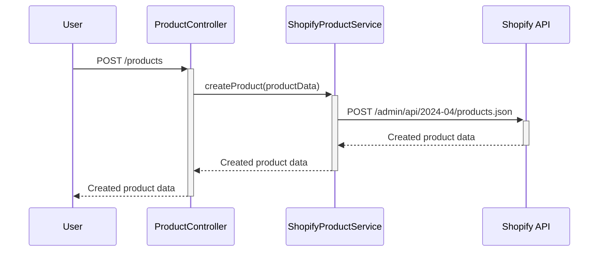
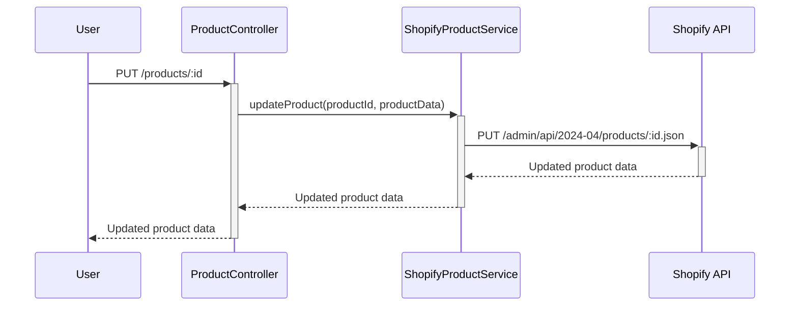
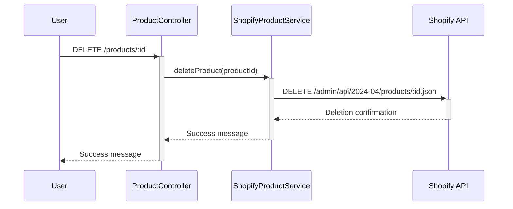

# RFC: Shopify Product Management Integration

| Status | Author                                                |
| ------ | ----------------------------------------------------- |
| Draft  | [Kurocado Studio](https://github.com/Kurocado-Studio) |

---

## **Context**

This RFC outlines the plan to implement Shopify product management features in a NestJS application
using the `@shopify/shopify-api` library. The goal is to simplify interactions with the Shopify API
by leveraging the official library, which handles authentication, API requests, and error handling.
The solution will be packaged as an NPM module for reuse and deployed using Docker and Fly.io, with
automated deployment via GitHub Actions.

## **Proposed Solution**

### **Architecture Overview**

- **Shopify Product Service**: A NestJS service that uses `@shopify/shopify-api` to interact with
  Shopify's product APIs.
- **Controller Layer**: NestJS controllers that expose RESTful endpoints for product management.
- **Error Handling**: Implement error handling using the library's built-in mechanisms and custom
  exceptions where necessary.
- **Testing**: Use Vitest for unit and integration tests to ensure code quality.
- **Release**: see
  [Release GitHub Action](https://kurocado-studio.github.io/styleguide/release.html).
- **Deployment**: see
  [Reusable Composite Action for Deploying Dockerized App to Fly.io](https://github.com/Kurocado-Studio/styleguide/issues/29)

---

### **Sequence Diagrams**

#### **1. Product Retrieval Flow (GET)**

---

#### **2. Product Creation Flow (POST)**

---

#### **3. Product Update Flow (PUT)**

---

#### **4. Product Deletion Flow (DELETE)**

---

### **Environment Variables**

The following environment variables will be used to securely store Shopify API credentials:

- `SHOPIFY_API_KEY`: Your Shopify API key.
- `SHOPIFY_API_SECRET`: Your Shopify API secret key.
- `SHOPIFY_ACCESS_TOKEN`: The access token for authenticated API requests.
- `SHOPIFY_STORE_URL`: The store URL to interact with the correct Shopify instance.

Ensure these variables are securely stored and accessed using a configuration management system or
environment variable management in your deployment platform.

---

### **Testing**

- **Testing Framework**: Use Vitest for unit and integration tests.
- **Unit Tests**:
  - Test all service methods, covering both successful operations and error scenarios.
  - Use mocking to simulate Shopify API responses.
- **Integration Tests**:
  - Test the full flow from the controller layer to the service layer.
  - Ensure that the application interacts correctly with the Shopify API.
- **Test Coverage**:
  - Aim for high code coverage to ensure reliability and detect potential issues early.
- **Continuous Integration**:
  - Integrate tests into the CI/CD pipeline to run automatically on code commits or pull requests.

---

### **Deployment**

- **Dockerization**:
  - Create a `Dockerfile` to containerize the NestJS application.
  - Ensure the Docker image is optimized for production use, with minimal size and efficient build
    steps.
- **Fly.io Deployment**:
  - Use Fly.io to host the Dockerized application.
  - Configure the `fly.toml` file with appropriate settings for the application.
  - Set up environment variables and secrets in Fly.io for Shopify credentials.
- **GitHub Actions**:
  - Automate the build and deployment process using GitHub Actions.
  - Create a workflow that triggers on pushes to the main branch.
  - The workflow should:
    - Build the Docker image.
    - Authenticate with Fly.io using a secure token.
    - Deploy the image to Fly.io.
  - Store sensitive data like the Fly.io API token in GitHub Secrets.

---

## **Dependencies**

- **NestJS Framework**: For building the backend application.
- **@shopify/shopify-api Library**: Official Shopify library for API interactions.
- **Vitest**: For unit and integration testing.
- **Docker**: For containerizing the application.
- **Fly.io**: For application deployment.
- **GitHub Actions**: For automating the deployment process.

## **Risks and Mitigations**

- **Dependency Updates**: Ensure compatibility with the latest versions of `@shopify/shopify-api`
  and other dependencies.

  - _Mitigation_: Specify exact versions in `package.json` and test thoroughly after updates.

- **API Rate Limits**: Shopify API has rate limits that could affect operations.

  - _Mitigation_: Use built-in rate limiting features of the library and implement retries if
    necessary.

- **Security of Credentials**: Risk of exposing API credentials.
  - _Mitigation_: Use environment variables and secure storage mechanisms; avoid hardcoding any
    credentials.

---

## **Success Criteria**

- **Functional Service**: The NestJS application can perform all CRUD operations on Shopify products
  using `@shopify/shopify-api`.
- **Reusable Module**: The NPM package is published and can be integrated into other projects with
  minimal configuration.
- **Testing Coverage**: High test coverage is achieved with Vitest, ensuring reliability.
- **Automated Deployment**: The application is successfully deployed to Fly.io, with automated
  deployments triggered by GitHub Actions.

---

## **Approval**

- **Stakeholder**: Carlos Santiago
- **Sign-off Date**: [To be filled]

---

This updated RFC now includes the **Sequence Diagrams**, **Environment Variables**, **Testing**, and
**Deployment** sections that were previously in the PRD, aligning with your request to move these
sections into the RFC.

---

Let me know if you need any further adjustments!# RFC

Start typing here...
