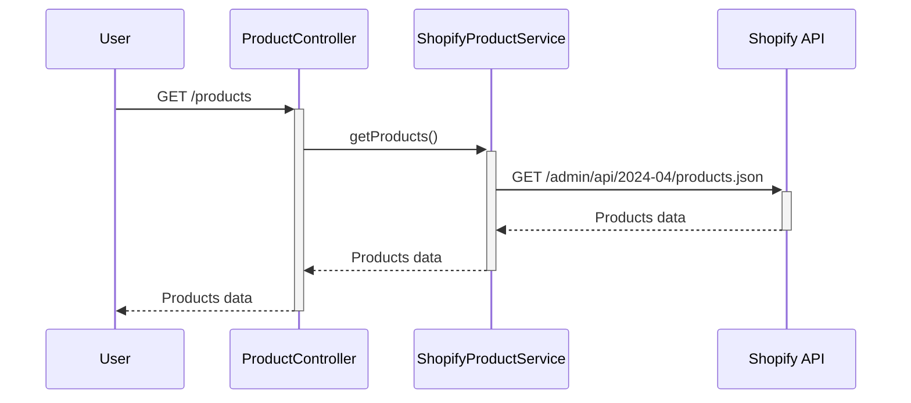
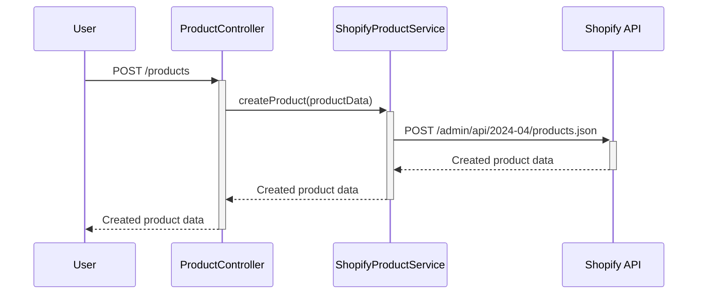
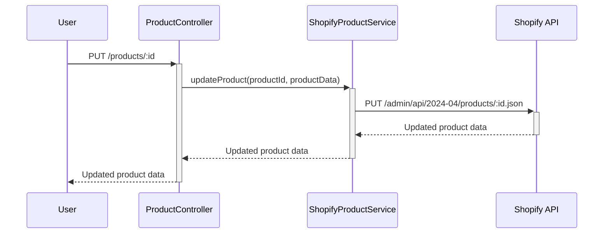
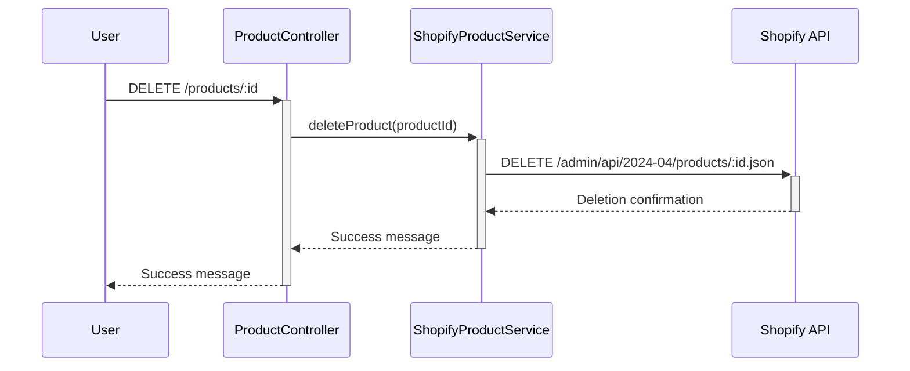

# PRD: Shopify Product Management Integration

---

## **Project Overview**

Integrate the [`@shopify/shopify-api`](https://www.npmjs.com/package/@shopify/shopify-api) package
with a NestJS backend to perform product management operations (CRUD). Leveraging Shopify's official
library simplifies authentication, API requests, and error handling. The solution will be packaged
as an NPM module for reuse in other projects and deployed using Docker and Fly.io, with deployment
automation via GitHub Actions.

---

## **Objectives**

- **Implement Product Management**: Use `@shopify/shopify-api` to handle CRUD operations for
  products in a NestJS application.
- **Simplify Integration**: Utilize the official Shopify library to streamline authentication and
  API interactions.
- **Package as NPM Module**: Make the solution reusable across projects by packaging it as an NPM
  module.
- **Automate Deployment**: Deploy the application using Docker and Fly.io, with GitHub Actions
  automating the process.
- **Ensure Quality**: Provide thorough testing using Vitest and clear implementation documentation.

---

## **Key Features**

1. **Retrieve Products**

- Fetch all products from Shopify.
- Endpoint: `GET /admin/api/2024-04/products.json`

2. **Create Product**

- Add new products to Shopify.
- Endpoint: `POST /admin/api/2024-04/products.json`

3. **Update Product**

- Modify existing products in Shopify.
- Endpoint: `PUT /admin/api/2024-04/products/{product_id}.json`

4. **Delete Product**

- Remove products from Shopify.
- Endpoint: `DELETE /admin/api/2024-04/products/{product_id}.json`

---

## **Sequence Diagrams**

### **Product Retrieval Flow (GET)**

### **Product Creation Flow (POST)**

### **Product Update Flow (PUT)**

### **Product Deletion Flow (DELETE)**

---

## **Non-Functional Requirements**

- **Security**: Securely store Shopify API credentials using environment variables.
- **Reusability**: Package the solution for easy integration into other projects.
- **Documentation**: Provide clear guides for implementation and testing.
- **Testing**: Use Vitest for unit and integration tests to ensure reliability.
- **Deployment**: Utilize Docker for containerization and Fly.io for deployment, automating with
  GitHub Actions.

---

## **Environment Variables**

The following environment variables will be used to securely store Shopify API credentials:

- `SHOPIFY_API_KEY`: Your Shopify API key.
- `SHOPIFY_API_SECRET`: Your Shopify API secret key.
- `SHOPIFY_ACCESS_TOKEN`: The access token for authenticated API requests.
- `SHOPIFY_STORE_URL`: The store URL to interact with the correct Shopify instance.

---

## **Assumptions**

- Valid Shopify API credentials are available.
- The `@shopify/shopify-api` package meets project requirements.
- Deployment will be conducted on Fly.io using Docker.

---

## **Success Metrics**

- **Functional Implementation**: All CRUD operations work correctly using `@shopify/shopify-api`.
- **Reusable Package**: The NPM module is published and can be integrated into other projects.
- **Testing Coverage**: Comprehensive tests are in place using Vitest.
- **Automated Deployment**: Deployment to Fly.io is automated via GitHub Actions.

---

## **Timeline**

- **Day 1-2**: Set up the project, integrate `@shopify/shopify-api`, implement product retrieval.
- **Day 3**: Implement product creation, updating, and deletion features.
- **Day 4**: Write and run tests using Vitest to ensure code quality.
- **Day 5**: Package the solution as an NPM module, create documentation, and set up automated
  deployment.

---

## **Deployment**

- **Dockerization**: Create a Dockerfile to containerize the application.
- **Fly.io Deployment**: Use Fly.io to deploy the Docker container.
- **GitHub Actions**: Automate deployment with a GitHub Actions workflow.

---

## **Testing**

- **Vitest**: Use Vitest for unit and integration tests.
- **Mocking**: Mock Shopify API responses where appropriate.
- **Coverage**: Ensure high test coverage for all CRUD operations and error handling.

---

## **Documentation**

- **Installation Guide**: Provide instructions on how to install and use the NPM package.
- **Usage Examples**: Include code snippets and examples for common use cases.
- **Deployment Instructions**: Document the deployment process and how to set up environment
  variables.

---

## **Approval**

- **Stakeholder**: Carlos Santiago
- **Sign-off Date**: [To be filled]

---

This PRD provides a concise yet comprehensive overview of the Shopify Product Management Integration
project, incorporating all the latest updates and sequence diagrams for all CRUD operations.

---
